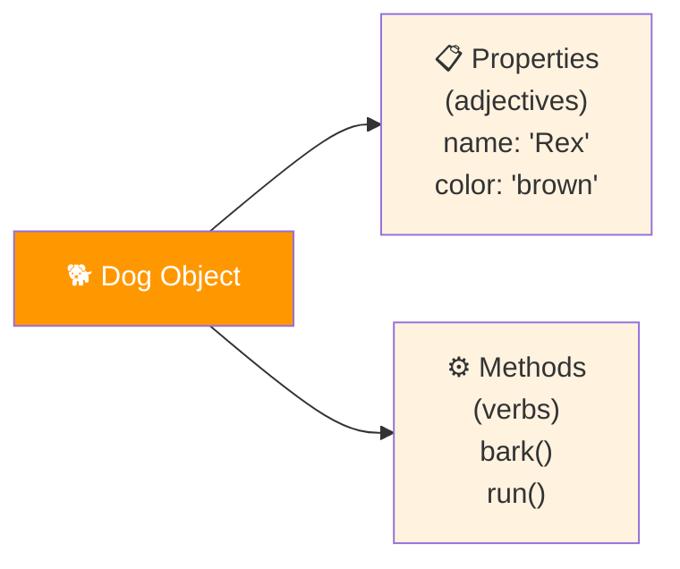
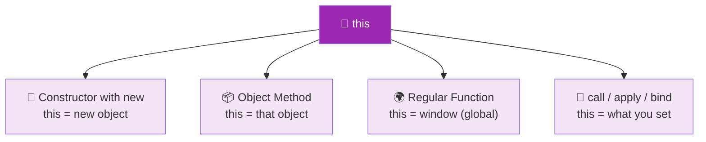
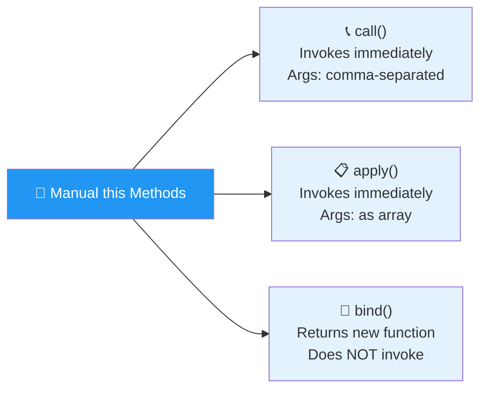
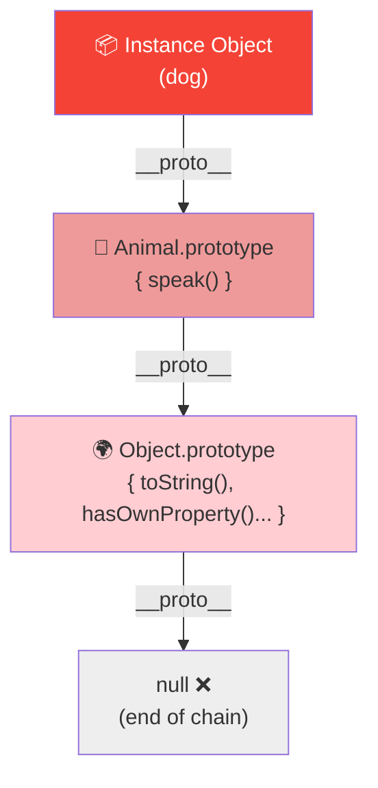
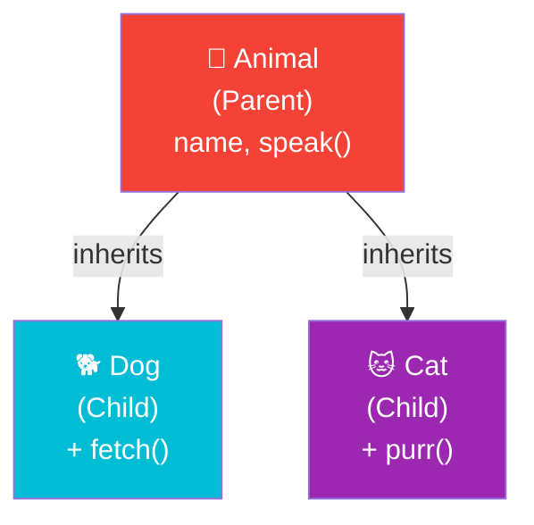
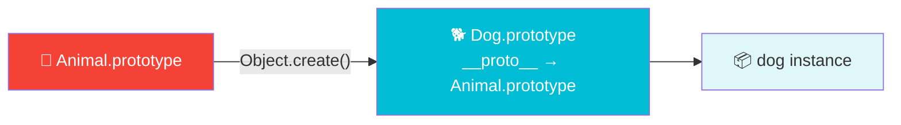

# 🏛️ Classes & Objects

> Model real-world things using objects, constructors, and prototypal inheritance!

---

## 🗺️ Roadmap


---

## 3.1 Introduction

Objects in JavaScript represent real-world things — they have **properties** (attributes) and **methods** (actions).



| Language Analogy | JavaScript |
|---|---|
| 🐕 Noun (dog, car) | Object |
| 🎨 Adjective (blue, fast) | Property value |
| 🏃 Verb (bark, drive) | Method |

> JavaScript does **not** have a traditional class system. Instead, it builds classes directly using **functions and objects** via constructor functions.

---

## 3.2 🧱 Constructor Functions

> A **constructor function** is a blueprint for creating multiple objects of the same type. Use the `new` keyword to instantiate a new object from it.

```mermaid
flowchart TD
    CF["🧱 Constructor Function\nAnimal(name, sound)"]
    CF -->|new Animal('Dog','Woof')| O1["🐕 Object 1\nname: 'Dog'\nsound: 'Woof'"]
    CF -->|new Animal('Cat','Meow')| O2["🐱 Object 2\nname: 'Cat'\nsound: 'Meow'"]
    CF -->|new Animal('Cow','Moo')| O3["🐄 Object 3\nname: 'Cow'\nsound: 'Moo'"]

    style CF fill:#FF9800,color:#fff
    style O1 fill:#FFF3E0,color:#333
    style O2 fill:#FFF3E0,color:#333
    style O3 fill:#FFF3E0,color:#333
```

### What `new` does step by step

```
1. 🆕 Creates a new empty object {}
2. 🔗 Links it to the constructor's prototype
3. 📌 Sets `this` to the new object
4. ↩️ Returns the new object
```

### ✅ Examples

**Basic Constructor Function**
```javascript
function Animal(name, sound) {
  this.name = name;
  this.sound = sound;
  this.speak = function() {
    return `${this.name} says ${this.sound}!`;
  };
}

const dog = new Animal("Dog", "Woof");
const cat = new Animal("Cat", "Meow");

console.log(dog.speak()); // Dog says Woof!
console.log(cat.speak()); // Cat says Meow!
```

**Constructor with prototype method (better practice)**
```javascript
function Person(name, age) {
  this.name = name;
  this.age = age;
}

// Add method to prototype — shared across all instances
Person.prototype.greet = function() {
  return `Hi, I'm ${this.name} and I'm ${this.age}!`;
};

const alice = new Person("Alice", 25);
const bob = new Person("Bob", 30);

console.log(alice.greet()); // Hi, I'm Alice and I'm 25!
console.log(bob.greet());   // Hi, I'm Bob and I'm 30!
```

---

## 3.3 🔑 The `this` Keyword

> `this` refers to the **object that is currently calling the function**. Its value depends on the context.



### ✅ Examples

**`this` in a constructor**
```javascript
function Car(make, model) {
  this.make = make;   // this = new Car object
  this.model = model;
}

const myCar = new Car("Toyota", "Corolla");
console.log(myCar.make);  // Toyota
console.log(myCar.model); // Corolla
```

**`this` in an object method**
```javascript
const user = {
  name: "Alice",
  greet() {
    return `Hello, I'm ${this.name}`; // this = user object
  }
};

console.log(user.greet()); // Hello, I'm Alice
```

**`this` in a regular function (global)**
```javascript
function showThis() {
  console.log(this); // window (in browser) or global (in Node)
}
showThis();
```

---

## 3.4 🎯 Setting Our Own `this`

> JavaScript gives us 3 methods to **manually control** what `this` refers to.



| Method | Invokes Immediately? | Arguments |
|---|---|---|
| `call()` | ✅ Yes | Comma-separated |
| `apply()` | ✅ Yes | Array |
| `bind()` | ❌ No (returns new fn) | Comma-separated |

### ✅ Examples

**Setup — shared function & two objects**
```javascript
function introduce(city, country) {
  return `I'm ${this.name} from ${city}, ${country}.`;
}

const alice = { name: "Alice" };
const bob   = { name: "Bob" };
```

**`call()` — args comma-separated**
```javascript
console.log(introduce.call(alice, "Paris", "France"));
// I'm Alice from Paris, France.
```

**`apply()` — args as array**
```javascript
console.log(introduce.apply(bob, ["Tokyo", "Japan"]));
// I'm Bob from Tokyo, Japan.
```

**`bind()` — returns a new function**
```javascript
const aliceIntro = introduce.bind(alice, "London", "UK");
console.log(aliceIntro()); // I'm Alice from London, UK.

// Useful for event handlers
const btn = { label: "Submit" };
function handleClick() {
  console.log(`Clicked: ${this.label}`);
}
const boundClick = handleClick.bind(btn);
boundClick(); // Clicked: Submit
```

---

## 3.5 🧬 Prototypal Inheritance

> Every object has a secret link to its constructor's **prototype**. If a property isn't found on the object, JS walks up the **prototype chain**.



### How JS looks up a property

```
🔍 dog.speak()
   1. Check dog object itself → ❌ not found
   2. Check Animal.prototype  → ✅ found! Execute it.

🔍 dog.toString()
   1. Check dog object        → ❌
   2. Check Animal.prototype  → ❌
   3. Check Object.prototype  → ✅ found!
```

### Useful Methods

| Method | What it does |
|---|---|
| `hasOwnProperty()` | Checks if property belongs to the object itself |
| `isPrototypeOf()` | Checks if object is in another's prototype chain |
| `Object.getPrototypeOf()` | Returns the prototype of an object |
| `.constructor` | Points back to the constructor function |

### ✅ Examples

**Prototype chain in action**
```javascript
function Animal(name) {
  this.name = name;
}

Animal.prototype.speak = function() {
  return `${this.name} makes a sound.`;
};

const dog = new Animal("Rex");

console.log(dog.speak());              // Rex makes a sound.
console.log(dog.hasOwnProperty("name"));  // true  (own property)
console.log(dog.hasOwnProperty("speak")); // false (on prototype)
console.log(Animal.prototype.isPrototypeOf(dog)); // true
console.log(Object.getPrototypeOf(dog) === Animal.prototype); // true
console.log(dog.constructor === Animal); // true
```

---

## 3.6 👶 Subclasses (Prototypal Inheritance)

> A **subclass** is a "child" object that inherits from a "parent" but can also have its own unique properties and methods.



### The right way: `Object.create()`



> ⚠️ Never use `__proto__` directly in code. Use `Object.create()` instead.

### ✅ Examples

**Setting up a subclass**
```javascript
// Parent
function Animal(name) {
  this.name = name;
}
Animal.prototype.speak = function() {
  return `${this.name} makes a sound.`;
};

// Child
function Dog(name, breed) {
  Animal.call(this, name); // inherit parent properties
  this.breed = breed;
}

// Link prototypes using Object.create()
Dog.prototype = Object.create(Animal.prototype);
Dog.prototype.constructor = Dog; // fix constructor reference

// Add Dog-specific method
Dog.prototype.fetch = function() {
  return `${this.name} fetches the ball! 🎾`;
};

const rex = new Dog("Rex", "Labrador");

console.log(rex.speak());  // Rex makes a sound.  (inherited)
console.log(rex.fetch());  // Rex fetches the ball! 🎾 (own)
console.log(rex instanceof Dog);    // true
console.log(rex instanceof Animal); // true
```

**Multiple subclasses from same parent**
```javascript
function Cat(name) {
  Animal.call(this, name);
}
Cat.prototype = Object.create(Animal.prototype);
Cat.prototype.constructor = Cat;

Cat.prototype.purr = function() {
  return `${this.name} purrs... 😸`;
};

const whiskers = new Cat("Whiskers");
console.log(whiskers.speak()); // Whiskers makes a sound.
console.log(whiskers.purr());  // Whiskers purrs... 😸
```

**`Object.create()` directly**
```javascript
const animal = {
  speak() {
    return `${this.name} makes a sound.`;
  }
};

const dog = Object.create(animal);
dog.name = "Buddy";
dog.fetch = function() {
  return `${this.name} fetches! 🎾`;
};

console.log(dog.speak());  // Buddy makes a sound.
console.log(dog.fetch());  // Buddy fetches! 🎾
```

---

## 📊 Concepts Summary

```mermaid
mindmap
  root((🏛️ Classes & Objects))
    🧱 Constructor Functions
      new keyword
      Blueprint for objects
      Prototype methods
    🔑 this Keyword
      Constructor context
      Method context
      Global context
    🎯 Setting this
      call()
      apply()
      bind()
    🧬 Prototypal Inheritance
      Prototype chain
      hasOwnProperty
      Object.getPrototypeOf
    👶 Subclasses
      Object.create()
      Inherit parent
      Own methods
```

---

## ⚡ Quick Reference

```javascript
// 🧱 Constructor
function Animal(name) { this.name = name; }
Animal.prototype.speak = function() { return `${this.name}!`; };
const dog = new Animal("Rex");

// 🔑 this
dog.speak();          // this = dog
introduce.call(obj);  // this = obj
introduce.apply(obj, [args]);
const fn = introduce.bind(obj);

// 🧬 Prototype check
dog.hasOwnProperty("name");           // true
Animal.prototype.isPrototypeOf(dog);  // true
Object.getPrototypeOf(dog);           // Animal.prototype

// 👶 Subclass
function Dog(name) { Animal.call(this, name); }
Dog.prototype = Object.create(Animal.prototype);
Dog.prototype.constructor = Dog;
```

---

<div align="center">

**Next → 🎨 [OOP Design Patterns](./oopDesignPatterns.md)**

`Constructor` • `this` • `call/apply/bind` • `Prototype` • `Subclasses`

</div>
