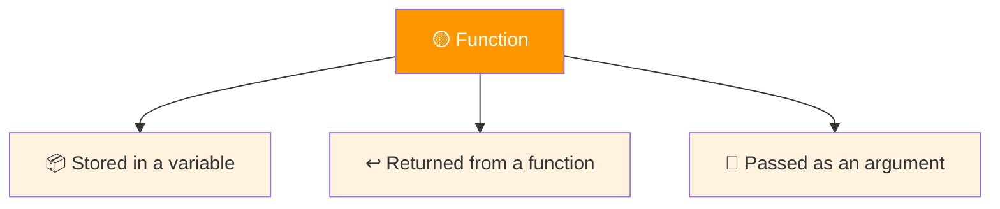
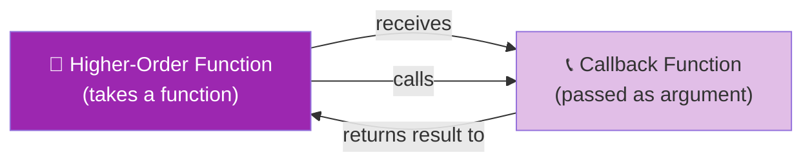
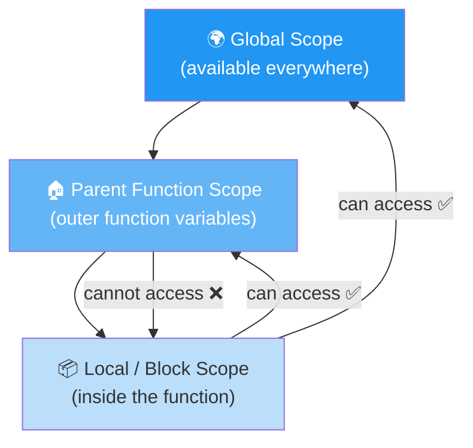
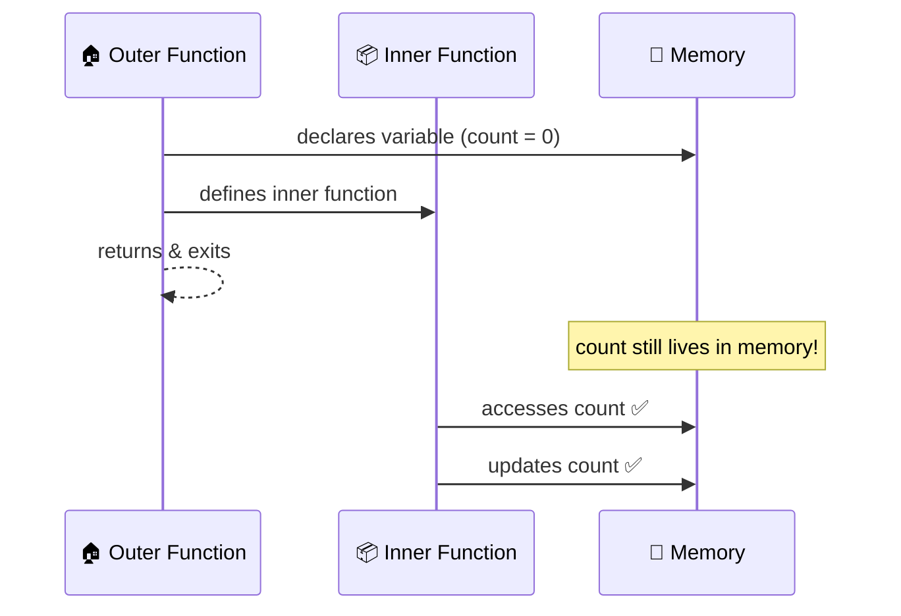
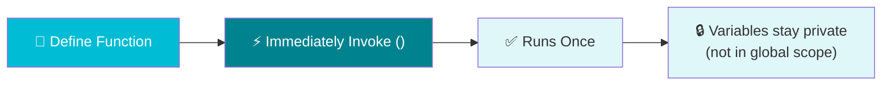
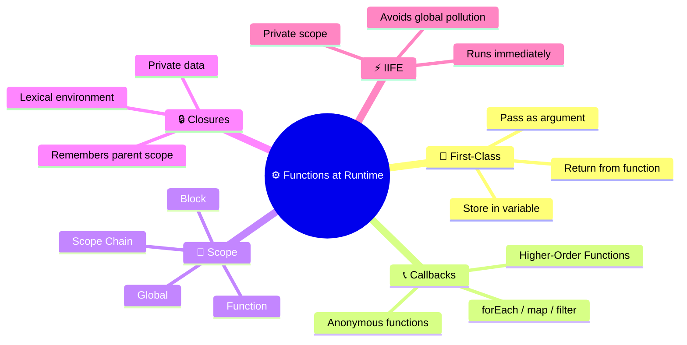

# ⚙️ Functions at Runtime

> Functions in JavaScript are more than just reusable blocks of code — they're **first-class citizens** with superpowers!

---

## 🗺️ Roadmap


---

## 2.1 Introduction

At runtime, JavaScript functions behave in powerful ways. They can be stored, passed around, and even remember the environment they were created in. This section covers the core concepts that make JavaScript functions so flexible.

```
Functions at Runtime
├── 🥇 First-Class Functions  → treat functions like values
├── 📞 Callbacks              → pass functions as arguments
├── 🔭 Scope                  → what variables a function can see
├── 🔒 Closures               → functions that remember their birthplace
└── ⚡ IIFE                   → functions that run immediately
```

---

## 2.2 🥇 First-Class Functions

> In JavaScript, **functions are first-class** — they can be treated just like strings, numbers, or arrays.



### ✅ Examples

**1. Stored in a variable**
```javascript
const greet = function(name) {
  return `Hello, ${name}!`;
};

console.log(greet("Alice")); // Hello, Alice!
```

**2. Returned from a function**
```javascript
function makeMultiplier(x) {
  return function(y) {
    return x * y;
  };
}

const double = makeMultiplier(2);
console.log(double(5));  // 10
console.log(double(10)); // 20
```

**3. Passed as an argument**
```javascript
function sayHello() {
  console.log("Hello! 👋");
}

function runFunction(fn) {
  fn(); // calling the passed function
}

runFunction(sayHello); // Hello! 👋
```

---

## 2.3 📞 Callbacks & Higher-Order Functions



| Term | Definition |
|---|---|
| **Higher-Order Function** | A function that takes another function as an argument |
| **Callback Function** | A function passed into another function as an argument |

### ✅ Examples

**Basic Callback**
```javascript
function greetUser(name, formatter) {
  return formatter(name);
}

const shout = name => name.toUpperCase() + "!!!";
const whisper = name => name.toLowerCase() + "...";

console.log(greetUser("Alice", shout));   // ALICE!!!
console.log(greetUser("Alice", whisper)); // alice...
```

**Array Methods with Callbacks**
```javascript
const numbers = [1, 2, 3, 4, 5];

// forEach — iterate
numbers.forEach(n => console.log(n));

// map — transform
const doubled = numbers.map(n => n * 2);
console.log(doubled); // [2, 4, 6, 8, 10]

// filter — select
const evens = numbers.filter(n => n % 2 === 0);
console.log(evens); // [2, 4]

// reduce — accumulate
const sum = numbers.reduce((acc, n) => acc + n, 0);
console.log(sum); // 15
```

**Anonymous vs Named Callback**
```javascript
// Anonymous callback (no name needed)
setTimeout(function() {
  console.log("⏰ 1 second later!");
}, 1000);

// Arrow function callback
setTimeout(() => console.log("⏰ Also 1 second!"), 1000);
```

---

## 2.4 🔭 Scope

> Scope = **what variables a function can see and use**.



### Scope Chain — How JS Finds Variables

```
🔍 JS Engine looks for a variable:
   1. Local scope (current function)
   2. Parent function scope
   3. Global scope
   4. ❌ ReferenceError if not found
```

### `var` vs `let` / `const`

| Keyword | Scope | Hoisted |
|---|---|---|
| `var` | Function-scoped | ✅ Yes |
| `let` | Block-scoped | ❌ No |
| `const` | Block-scoped | ❌ No |

### ✅ Examples

**Function Scope**
```javascript
function outer() {
  const outerVar = "I'm outer 🏠";

  function inner() {
    const innerVar = "I'm inner 📦";
    console.log(outerVar); // ✅ can access parent scope
    console.log(innerVar); // ✅ local
  }

  inner();
  // console.log(innerVar); // ❌ ReferenceError
}
outer();
```

**`var` vs `let` in blocks**
```javascript
function testVar() {
  if (true) {
    var x = "var"; // function-scoped
    let y = "let"; // block-scoped
  }
  console.log(x); // ✅ "var"
  // console.log(y); // ❌ ReferenceError
}
testVar();
```

**Scope Chain in action**
```javascript
const globalMsg = "🌍 Global";

function outer() {
  const outerMsg = "🏠 Outer";

  function inner() {
    const innerMsg = "📦 Inner";
    console.log(innerMsg);  // 📦 Inner
    console.log(outerMsg);  // 🏠 Outer  (parent scope)
    console.log(globalMsg); // 🌍 Global (global scope)
  }

  inner();
}
outer();
```

---

## 2.5 🔒 Closures

> A **closure** = a function + the lexical environment it was declared in.
> The inner function **remembers** variables from its outer scope, even after the outer function has returned.



### ✅ Examples

**Basic Closure**
```javascript
function makeCounter() {
  let count = 0; // remembered by closure

  return function() {
    count++;
    return count;
  };
}

const counter = makeCounter();
console.log(counter()); // 1
console.log(counter()); // 2
console.log(counter()); // 3
// count is private — can't access it directly!
```

**Closure for Private Data**
```javascript
function createBankAccount(initialBalance) {
  let balance = initialBalance; // private!

  return {
    deposit(amount) { balance += amount; },
    withdraw(amount) { balance -= amount; },
    getBalance() { return balance; }
  };
}

const account = createBankAccount(100);
account.deposit(50);
account.withdraw(30);
console.log(account.getBalance()); // 120
// console.log(balance); // ❌ not accessible
```

**Closure remembers parent scope after return**
```javascript
function greetMaker(greeting) {
  return function(name) {
    return `${greeting}, ${name}!`; // greeting is remembered
  };
}

const sayHi = greetMaker("Hi");
const sayHey = greetMaker("Hey");

console.log(sayHi("Alice"));  // Hi, Alice!
console.log(sayHey("Bob"));   // Hey, Bob!
```

---

## 2.6 ⚡ IIFE — Immediately Invoked Function Expressions

> An **IIFE** is a function that **runs immediately** after it's defined.
> Syntax: wrap the function in `()`, then call it with `()`.



### Syntax

```javascript
// Classic IIFE
(function() {
  // code here
})();

// Arrow function IIFE
(() => {
  // code here
})();
```

### ✅ Examples

**Basic IIFE**
```javascript
(function() {
  const message = "I run immediately! ⚡";
  console.log(message);
})();

// console.log(message); // ❌ not accessible outside
```

**IIFE with parameters**
```javascript
(function(name) {
  console.log(`Hello, ${name}! 👋`);
})("Alice");
// Hello, Alice! 👋
```

**IIFE for private scope (avoid global pollution)**
```javascript
const result = (function() {
  const privateData = 42; // stays private
  return privateData * 2;
})();

console.log(result); // 84
// console.log(privateData); // ❌ ReferenceError
```

**IIFE + Closure = Private State**
```javascript
const counter = (function() {
  let count = 0; // private

  return {
    increment() { count++; },
    decrement() { count--; },
    value() { return count; }
  };
})();

counter.increment();
counter.increment();
counter.decrement();
console.log(counter.value()); // 1
```

---

## 📊 Concepts Summary



---

## ⚡ Quick Reference

```javascript
// 🥇 First-Class: store, return, pass
const fn = () => "stored!";
const make = x => y => x + y;       // returns a function
runIt(fn);                           // passed as argument

// 📞 Callback
[1,2,3].map(n => n * 2);            // [2, 4, 6]

// 🔭 Scope
const g = "global";
function outer() {
  const o = "outer";
  function inner() { console.log(g, o); } // sees both
}

// 🔒 Closure
function counter() {
  let n = 0;
  return () => ++n;                  // remembers n
}

// ⚡ IIFE
(function() { /* runs once, stays private */ })();
```

---

<div align="center">

**Next → 🏛️ [Classes & Objects](./classesAndObjects.md)**

`First-Class` • `Callbacks` • `Scope` • `Closures` • `IIFE`

</div>
