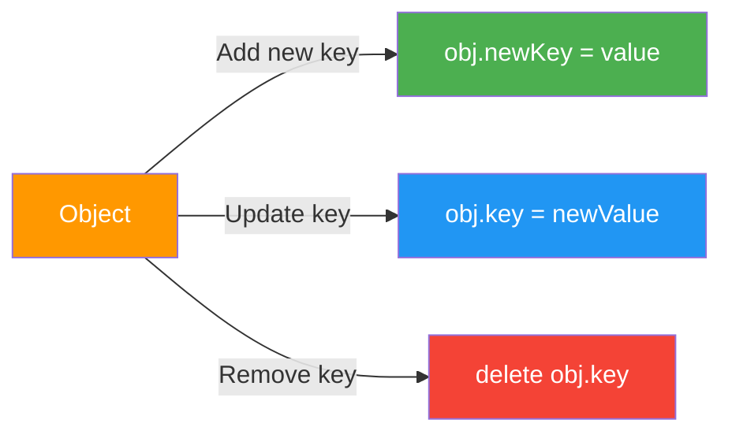
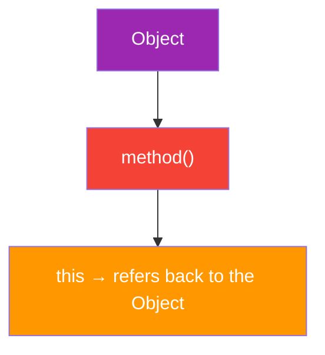
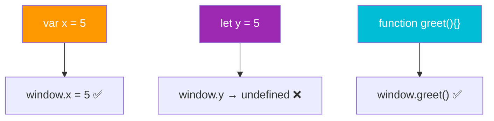
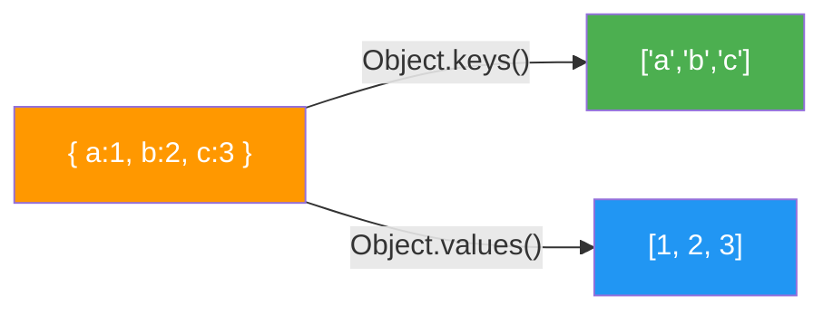
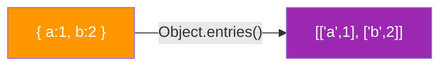
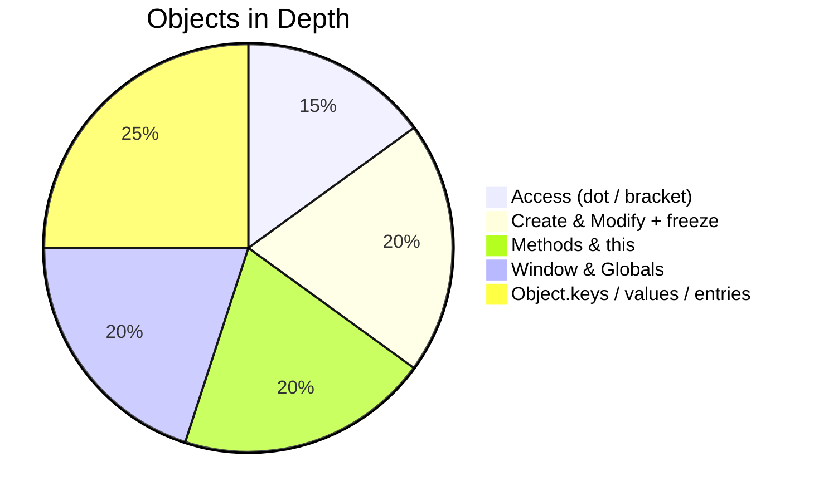

# 📦 Objects in Depth

> JavaScript objects: create, read, modify, delete, and extract — all in one place.

---

## 🗺️ Roadmap


---

## 1️⃣ What is an Object?

> An **unordered collection of key/value pairs**. Keys are strings; values can be anything.

```
Object
├── key: "primitive"   → string, number, boolean
└── key: { }           → another object
```

```javascript
const car = {
  brand: "Toyota",   // string
  year: 2023,        // number
  electric: false,   // boolean
  engine: {          // nested object
    cylinders: 4
  }
};
```

### 🔍 Accessing Properties

| Notation | Syntax | Use when |
|---|---|---|
| Dot | `car.brand` | Key is a known identifier |
| Bracket | `car["brand"]` | Key is dynamic / has spaces |

```javascript
console.log(car.brand);         // "Toyota"
console.log(car["year"]);       // 2023

const key = "electric";
console.log(car[key]);          // false  ← dynamic key
```

---

## 2️⃣ Create, Modify & Delete Properties



```javascript
const user = { name: "Alice", age: 25 };

// ➕ Add
user.email = "alice@example.com";

// ✏️ Modify
user.age = 26;

// ❌ Delete
delete user.email;

console.log(user); // { name: "Alice", age: 26 }
```

> ⚠️ Objects are **mutable by default** — properties can be freely added, changed, or removed.

### Adding Methods Dynamically

```javascript
const user = { name: "Alice" };

// Add a method after creation
user.greet = function () {
  return `Hello, I'm ${this.name}`;
};

console.log(user.greet()); // "Hello, I'm Alice"
```

### 🔒 Prevent Mutations with `Object.freeze()`

```javascript
const config = Object.freeze({ theme: "dark", lang: "en" });

config.theme = "light"; // ❌ silently ignored in strict mode
console.log(config.theme); // "dark" — unchanged
```

---

## 3️⃣ Methods & `this`

> A **method** is a function stored as a property of an object.



```javascript
const person = {
  name: "Bob",
  greet() {
    return `Hi, I'm ${this.name}!`;  // 'this' = person
  }
};

console.log(person.greet()); // "Hi, I'm Bob!"
```

### How `this` is determined

```
person.greet()
│
└── called ON person  →  this = person ✅
```

```javascript
const dog = {
  name: "Rex",
  speak: function () {
    return `${this.name} says: Woof!`;
  }
};

console.log(dog.speak()); // "Rex says: Woof!"
```

> 💡 `this` is **not** set when the function is defined — it's set when the method is **called**.

### Invoking via Bracket Notation

```javascript
const calculator = {
  value: 10,
  double() { return this.value * 2; },
  triple() { return this.value * 3; }
};

const method = "double";
console.log(calculator[method]()); // 20  ← dynamic method call
```

### Method Shorthand vs `function` keyword

```javascript
const obj = {
  a() { return this; },              // ✅ shorthand
  b: function () { return this; },   // ✅ function expression
  c: () => this                      // ⚠️ arrow — 'this' is NOT the object!
};
```

> ⚠️ **Never use arrow functions as methods** if you need `this` to refer to the object.

---

## 4️⃣ The `window` Object & Globals

> In browsers, `window` is the global object. `var` declarations and function declarations become its properties.



```javascript
var city = "Paris";
console.log(window.city); // "Paris"

let country = "France";
console.log(window.country); // undefined
```

> ⚠️ Avoid excessive global variables — they pollute the global scope and cause hard-to-find bugs.

### `this` Outside an Object

```javascript
// In browser (non-strict mode)
console.log(this === window); // true  ← global this = window

function showThis() {
  console.log(this); // window (non-strict) | undefined (strict)
}
showThis();
```

### Accidental Globals

```javascript
function setName() {
  name = "Alice"; // ❌ no var/let/const → becomes window.name!
}
setName();
console.log(window.name); // "Alice"  ← unintended global
```

> 💡 Always use `let`, `const`, or `var` to declare variables and avoid accidental globals.

---

## 5️⃣ `Object.keys()` & `Object.values()`

> Extract all keys or values from an object as an array.



```javascript
const scores = { math: 90, english: 85, science: 92 };

console.log(Object.keys(scores));   // ["math", "english", "science"]
console.log(Object.values(scores)); // [90, 85, 92]

// Practical: sum all values
const total = Object.values(scores).reduce((sum, val) => sum + val, 0);
console.log(total); // 267
```

### `Object.entries()` — key + value pairs



```javascript
const person = { name: "Alice", age: 25 };

Object.entries(person).forEach(([key, value]) => {
  console.log(`${key}: ${value}`);
});
// name: Alice
// age: 25
```

### Iterating with `for...in`

```javascript
const car = { brand: "Toyota", year: 2023 };

for (const key in car) {
  console.log(`${key} → ${car[key]}`);
}
// brand → Toyota
// year → 2023
```

> 💡 `for...in` iterates over **all enumerable properties**, including inherited ones. Use `Object.keys()` to stay safe with own properties only.

---

## ⚡ Quick Reference

```javascript
const obj = { a: 1, b: 2 };

obj.c = 3;                    // add
obj.a = 10;                   // modify
delete obj.b;                 // delete
obj.greet = function() { return this.a; }; // add method

Object.freeze(obj);           // lock object

Object.keys(obj);             // ["a", "c", "greet"]
Object.values(obj);           // [10, 3, f]
Object.entries(obj);          // [["a",10], ["c",3], ...]
```

---

## 📊 Concepts at a Glance



---

<div align="center">

**Next → [⚙️ Functions at Runtime](./functionAtRuntime.md)**

`objects` • `methods` • `this` • `globals` • `Object.keys`

</div>
