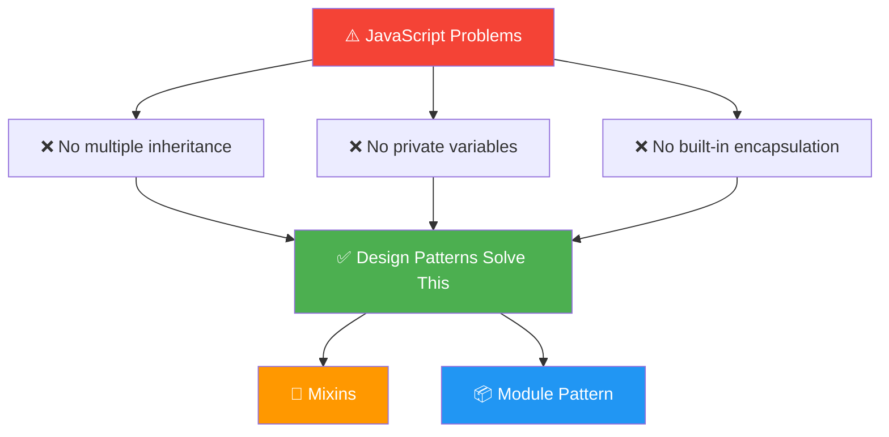
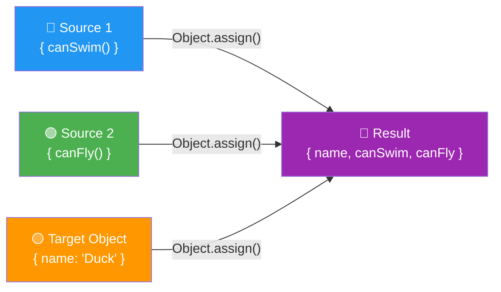
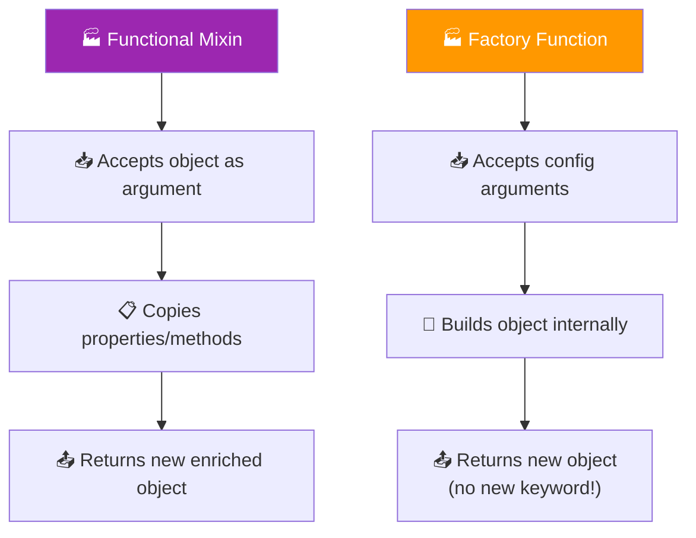
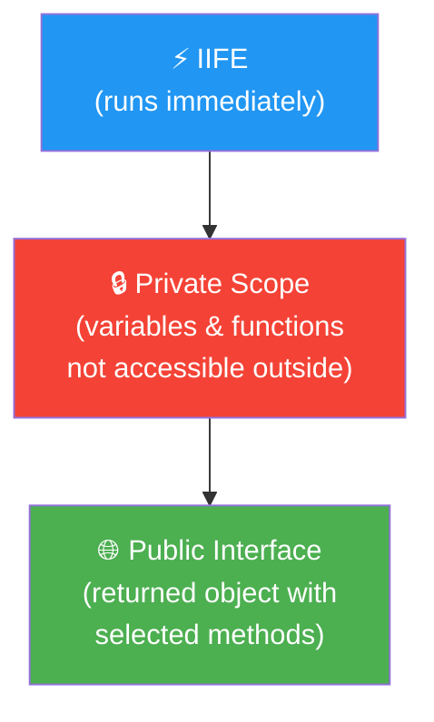
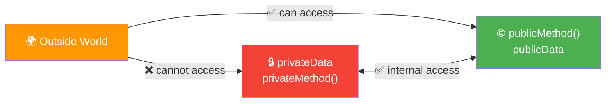
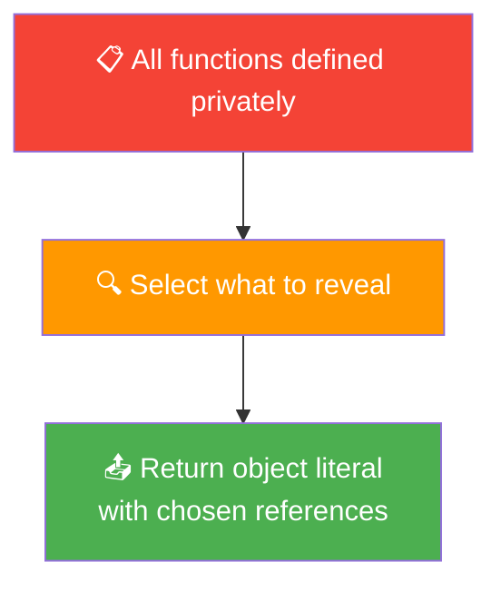
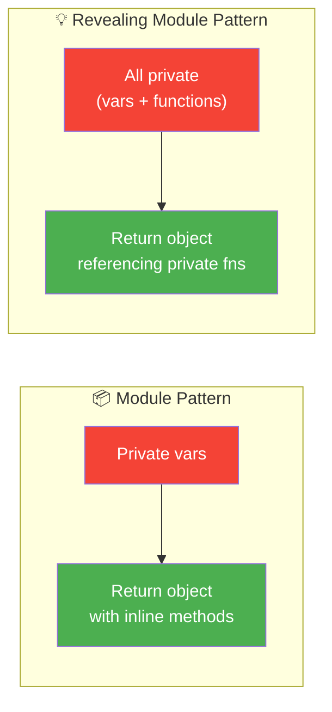

# 🎨 OOP Design Patterns

> Write flexible, reusable, and maintainable JavaScript using proven design patterns!

---

## 🗺️ Roadmap


---

## 4.1 Introduction

JavaScript doesn't have a traditional class system with built-in privacy or multiple inheritance. Design patterns fill that gap — they are **proven solutions** to common problems in OOP.

```
🎨 OOP Design Patterns
├── 🧩 Mixins               → copy properties from multiple sources
├── 🏭 Functional Mixins    → factory functions + mixins combined
├── 📦 Module Pattern       → private data via closures + IIFE
└── 💡 Revealing Module     → controlled public interface
```



---

## 4.2 🧩 Mixins

> A **mixin** copies data and functionality from one or more **source objects** into a **target object** using `Object.assign()`.



### `Object.assign()` Syntax

```javascript
Object.assign(target, source1, source2, ...);
// Copies all properties from sources INTO target
// Returns the modified target
```

### ✅ Examples

**Basic Mixin**
```javascript
const canSwim = {
  swim() {
    return `${this.name} is swimming 🏊`;
  }
};

const canFly = {
  fly() {
    return `${this.name} is flying 🦅`;
  }
};

const duck = { name: "Donald" };

Object.assign(duck, canSwim, canFly);

console.log(duck.swim()); // Donald is swimming 🏊
console.log(duck.fly());  // Donald is flying 🦅
```

**Mixin into a Constructor Prototype**
```javascript
function Bird(name) {
  this.name = name;
}

const flyMixin = {
  fly() { return `${this.name} soars through the sky! ✈️`; },
  land() { return `${this.name} lands safely. 🛬`; }
};

Object.assign(Bird.prototype, flyMixin);

const parrot = new Bird("Polly");
console.log(parrot.fly());  // Polly soars through the sky! ✈️
console.log(parrot.land()); // Polly lands safely. 🛬
```

**Combining multiple mixins**
```javascript
const serializable = {
  serialize() { return JSON.stringify(this); }
};

const loggable = {
  log() { console.log(`[LOG] ${this.name}`); }
};

function User(name, role) {
  this.name = name;
  this.role = role;
}

Object.assign(User.prototype, serializable, loggable);

const admin = new User("Alice", "admin");
admin.log();                    // [LOG] Alice
console.log(admin.serialize()); // {"name":"Alice","role":"admin"}
```

---

## 4.3 🏭 Functional Mixins

> A **factory function** creates and returns a new object without using `new`.
> A **functional mixin** takes a mixin as an argument, copies its properties, and returns a new object.



### Factory Function vs Constructor

| | Factory Function | Constructor Function |
|---|---|---|
| Invocation | `createDog("Rex")` | `new Dog("Rex")` |
| Returns | Object explicitly | Object implicitly |
| `this` | Not needed | Required |
| `new` keyword | ❌ Not used | ✅ Required |

### ✅ Examples

**Factory Function**
```javascript
function createAnimal(name, sound) {
  return {
    name,
    sound,
    speak() {
      return `${this.name} says ${this.sound}!`;
    }
  };
}

const dog = createAnimal("Rex", "Woof");
const cat = createAnimal("Whiskers", "Meow");

console.log(dog.speak()); // Rex says Woof!
console.log(cat.speak()); // Whiskers says Meow!
```

**Functional Mixin**
```javascript
const withSwimming = (obj) => Object.assign(obj, {
  swim() { return `${this.name} is swimming! 🏊`; }
});

const withFlying = (obj) => Object.assign(obj, {
  fly() { return `${this.name} is flying! 🦅`; }
});

// Create a duck that can both swim and fly
const duck = withFlying(withSwimming({ name: "Donald" }));

console.log(duck.swim()); // Donald is swimming! 🏊
console.log(duck.fly());  // Donald is flying! 🦅
```

**Functional Mixin with Factory**
```javascript
const withGreeting = (obj) => Object.assign(obj, {
  greet() { return `Hi, I'm ${this.name}!`; }
});

const withAge = (obj) => Object.assign(obj, {
  getAge() { return `${this.name} is ${this.age} years old.`; }
});

function createPerson(name, age) {
  const person = { name, age };
  return withGreeting(withAge(person));
}

const alice = createPerson("Alice", 25);
console.log(alice.greet());  // Hi, I'm Alice!
console.log(alice.getAge()); // Alice is 25 years old.
```

---

## 4.4 📦 The Module Pattern

> The **Module Pattern** uses **scope + closures + IIFE** to create **private** variables and methods, exposing only a public interface.





### ✅ Examples

**Basic Module Pattern**
```javascript
const BankAccount = (function() {
  // 🔒 Private
  let balance = 0;

  function validateAmount(amount) {
    return amount > 0;
  }

  // 🌐 Public interface
  return {
    deposit(amount) {
      if (validateAmount(amount)) balance += amount;
    },
    withdraw(amount) {
      if (validateAmount(amount) && amount <= balance) balance -= amount;
    },
    getBalance() {
      return balance;
    }
  };
})();

BankAccount.deposit(100);
BankAccount.deposit(50);
BankAccount.withdraw(30);
console.log(BankAccount.getBalance()); // 120

// console.log(balance);          // ❌ ReferenceError
// BankAccount.validateAmount(5); // ❌ not a function (private)
```

**Module with private state**
```javascript
const Counter = (function() {
  let count = 0;        // 🔒 private
  let step = 1;         // 🔒 private

  return {
    increment() { count += step; },
    decrement() { count -= step; },
    setStep(n) { step = n; },
    value() { return count; }
  };
})();

Counter.increment();
Counter.increment();
Counter.setStep(5);
Counter.increment();
console.log(Counter.value()); // 7
```

---

## 4.5 💡 The Revealing Module Pattern

> A variation of the Module Pattern where **all logic is defined privately**, and only selected items are **revealed** in the returned object.



### Module Pattern vs Revealing Module Pattern



### ✅ Examples

**Basic Revealing Module**
```javascript
const userModule = (function() {
  // 🔒 All private
  let name = "Guest";

  function setName(newName) {
    name = newName;
  }

  function getName() {
    return name;
  }

  function greet() {
    return `Hello, ${name}! 👋`;
  }

  // 💡 Reveal only what's needed
  return {
    setName,   // revealed
    getName,   // revealed
    greet      // revealed
    // name is NOT revealed — stays private
  };
})();

userModule.setName("Alice");
console.log(userModule.getName()); // Alice
console.log(userModule.greet());   // Hello, Alice! 👋
// console.log(userModule.name);   // undefined (private)
```

**Revealing Module — Shopping Cart**
```javascript
const Cart = (function() {
  let items = [];  // 🔒 private

  function addItem(item) {
    items.push(item);
  }

  function removeItem(name) {
    items = items.filter(i => i.name !== name);
  }

  function getTotal() {
    return items.reduce((sum, i) => sum + i.price, 0);
  }

  function getItems() {
    return [...items]; // return copy, not reference
  }

  // 💡 Reveal public API
  return { addItem, removeItem, getTotal, getItems };
})();

Cart.addItem({ name: "Apple", price: 1.5 });
Cart.addItem({ name: "Bread", price: 2.0 });
Cart.addItem({ name: "Milk",  price: 1.2 });
Cart.removeItem("Bread");

console.log(Cart.getItems());  // [{name:'Apple',...}, {name:'Milk',...}]
console.log(Cart.getTotal());  // 2.7
// console.log(items);         // ❌ ReferenceError (private)
```

---

## 📊 Patterns Comparison

```mermaid
mindmap
  root((🎨 OOP Design Patterns))
    🧩 Mixins
      Object.assign()
      Multiple sources
      Extend prototypes
    🏭 Functional Mixins
      Factory functions
      No new keyword
      Composable
    📦 Module Pattern
      IIFE
      Private scope
      Public interface
    💡 Revealing Module
      All private first
      Reveal selectively
      Clean public API
```

| Pattern | Key Tool | Privacy | Use When |
|---|---|---|---|
| 🧩 Mixin | `Object.assign()` | ❌ None | Sharing behavior across unrelated objects |
| 🏭 Functional Mixin | Factory + `Object.assign()` | ⚠️ Partial | Composing objects without `new` |
| 📦 Module | IIFE + Closure | ✅ Full | Hiding implementation details |
| 💡 Revealing Module | IIFE + Return literal | ✅ Full | Clean, readable public API |

---

## ⚡ Quick Reference

```javascript
// 🧩 Mixin
Object.assign(target, source1, source2);

// 🏭 Factory Function
function createDog(name) {
  return { name, bark() { return `${name} barks!`; } };
}

// 🏭 Functional Mixin
const withSwim = obj => Object.assign(obj, {
  swim() { return `${this.name} swims!`; }
});

// 📦 Module Pattern
const Module = (function() {
  let private = 0;
  return { get() { return private; } };
})();

// 💡 Revealing Module Pattern
const Reveal = (function() {
  let data = "secret";
  function getData() { return data; }
  return { getData };  // reveal only getData
})();
```

---

<div align="center">

**Next → 🦕 [Project: Dinosaurs](./dinosaurProject.md)**

`Mixins` • `Functional Mixins` • `Module Pattern` • `Revealing Module`

</div>
