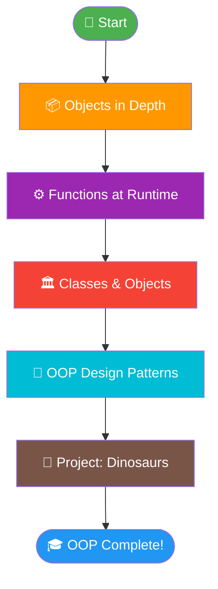
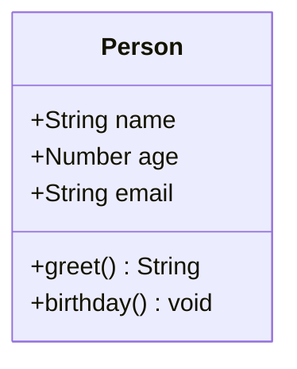
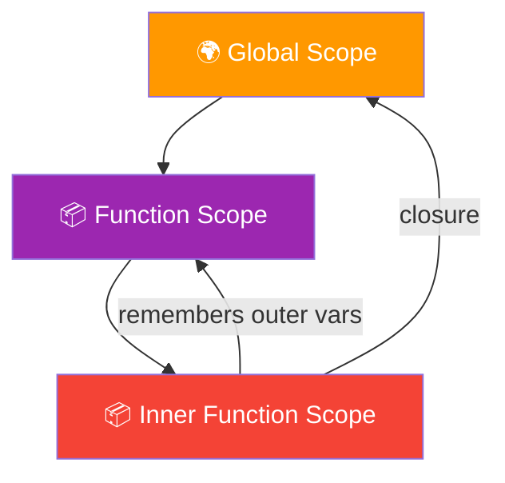
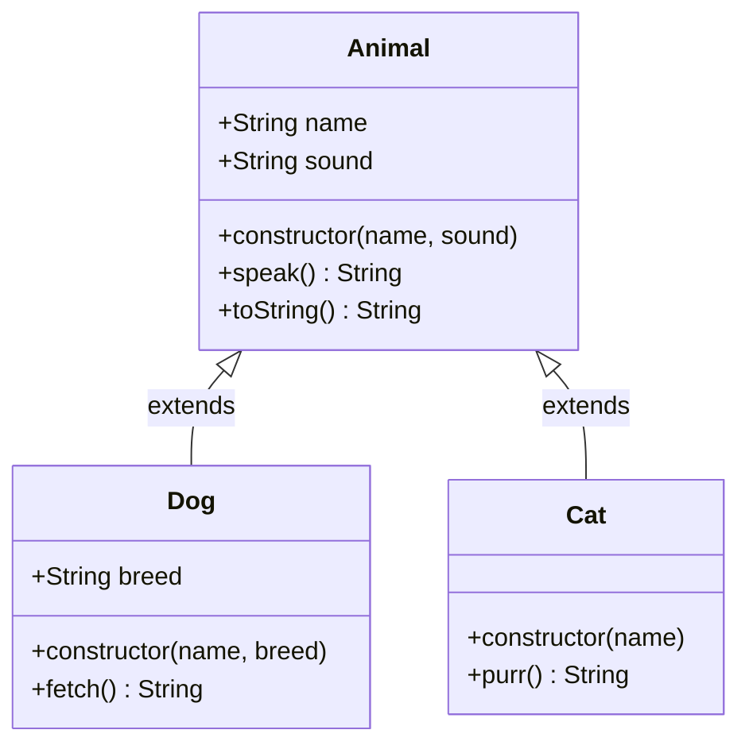
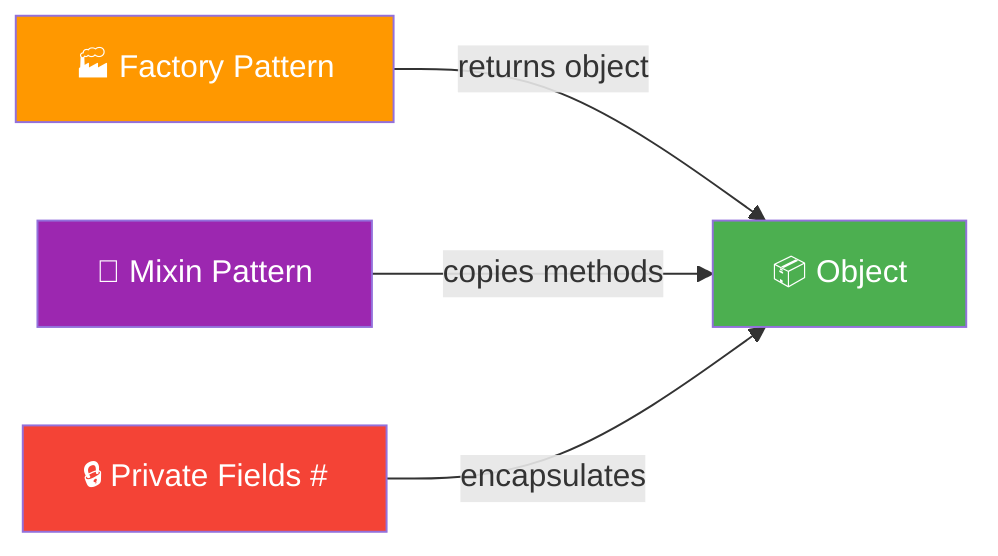
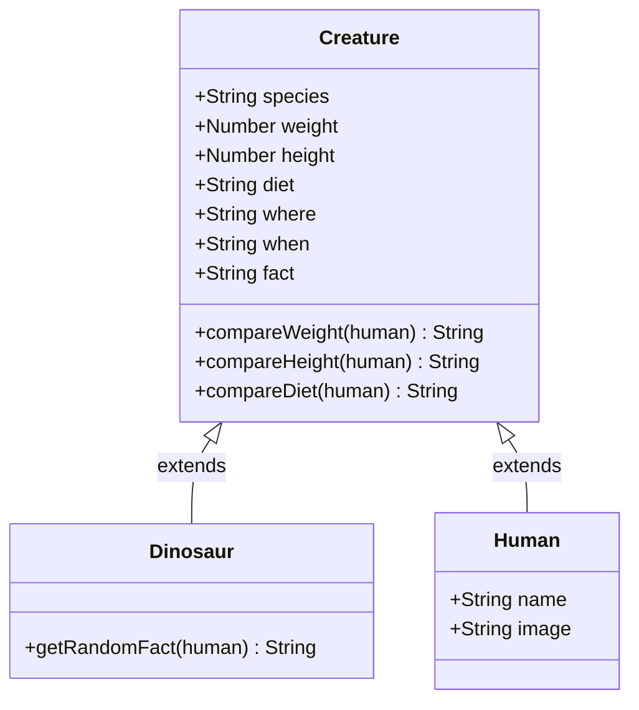
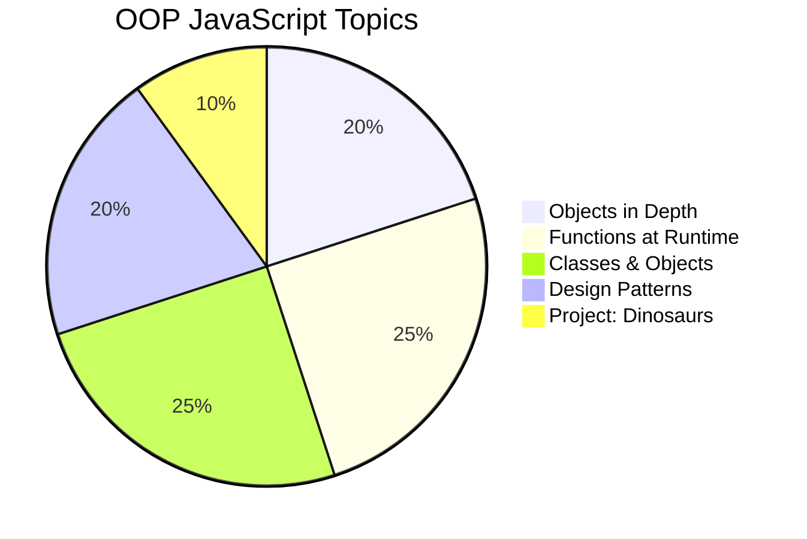

# 🏗️ Object-Oriented JavaScript

> Model real-world things using objects, classes, and inheritance.

---

## 🗺️ Learning Roadmap



---

## 1️⃣ Objects in Depth 📦

> Objects encapsulate both **data** (properties) and **functionality** (methods).



### 🔑 Key Concepts

| Concept | Description |
|---|---|
| 📝 Object Literal | `{}` syntax to create objects |
| 🔍 Property Access | Dot `.` or bracket `[]` notation |
| 🔄 Mutation | Add, update, delete properties |
| 🔁 Iteration | `for...in`, `Object.keys()`, `Object.values()` |
| 🧬 Nested Objects | Objects inside objects |

### 💡 Examples

```javascript
// ✅ Creating an object
const person = {
  name: "Alice",
  age: 25,
  address: {
    city: "New York",
    zip: "10001"
  },
  greet() {
    return `Hi, I'm ${this.name}!`;
  }
};

// 🔍 Accessing properties
console.log(person.name);           // "Alice"
console.log(person["age"]);         // 25
console.log(person.address.city);   // "New York"

// ✏️ Modifying properties
person.age = 26;
person.email = "alice@example.com"; // add new property
delete person.email;                // remove property

// 🔁 Iterating
Object.keys(person).forEach(key => console.log(key, person[key]));

// 🧪 Useful Object methods
const clone = Object.assign({}, person);          // shallow copy
const clone2 = { ...person };                     // spread copy
const frozen = Object.freeze({ x: 1 });           // immutable object
```

```
📦 person
├── name: "Alice"
├── age: 25
├── address
│   ├── city: "New York"
│   └── zip: "10001"
└── greet() → function
```

---

## 2️⃣ Functions at Runtime ⚙️

> Functions are **first-class citizens** in JavaScript — they can be stored, passed, and returned like any value.



### 🔑 Key Concepts

| Concept | Description |
|---|---|
| 🥇 First-Class Functions | Functions as values — store, pass, return |
| 🔭 Scope | Where variables are accessible |
| 🔗 Closures | Function retains access to its outer scope |
| ⚡ IIFE | Immediately Invoked Function Expression |
| 🏹 Arrow Functions | Concise syntax, lexical `this` |

### 💡 Examples

```javascript
// 🥇 First-class functions
const sayHello = function(name) { return `Hello, ${name}!`; };
const greet = sayHello;                    // store in variable
setTimeout(sayHello, 1000);               // pass as argument
const makeGreeter = () => name => `Hi ${name}!`; // return function

// 🔭 Scope
let globalVar = "I'm global";

function outer() {
  let outerVar = "I'm outer";

  function inner() {
    let innerVar = "I'm inner";
    console.log(globalVar);  // ✅ accessible
    console.log(outerVar);   // ✅ accessible
  }

  // console.log(innerVar);  // ❌ ReferenceError
}

// 🔗 Closure — counter with private state
function makeCounter() {
  let count = 0;              // private variable
  return {
    increment: () => ++count,
    decrement: () => --count,
    value: () => count
  };
}

const counter = makeCounter();
counter.increment(); // 1
counter.increment(); // 2
counter.value();     // 2

// ⚡ IIFE — runs immediately, keeps scope private
const result = (function() {
  const secret = "hidden";
  return { getSecret: () => secret };
})();

result.getSecret(); // "hidden"
// secret            // ❌ not accessible outside
```

```
🔗 Closure Visualization

makeCounter()
└── count = 0  ← private, lives in closure
    ├── increment() → count++
    ├── decrement() → count--
    └── value()     → count
```

---

## 3️⃣ Classes & Objects 🏛️

> Use **Classes** to create multiple similar objects easily. Understand **Prototypal Inheritance** — JavaScript's native inheritance model.



### 🔑 Key Concepts

| Concept | Description |
|---|---|
| 🏛️ Class | Blueprint for creating objects |
| 🔨 Constructor | Initializes object properties |
| 🧬 Inheritance | `extends` keyword |
| 🔁 `super()` | Call parent constructor/methods |
| 🔗 Prototype Chain | How JS looks up methods |

### 💡 Examples

```javascript
// 🏛️ Base class
class Animal {
  constructor(name, sound) {
    this.name = name;
    this.sound = sound;
  }

  speak() {
    return `${this.name} says ${this.sound}!`;
  }
}

// 🧬 Inheritance
class Dog extends Animal {
  constructor(name, breed) {
    super(name, "Woof");   // call parent constructor
    this.breed = breed;
  }

  fetch(item) {
    return `${this.name} fetches the ${item}! 🎾`;
  }
}

class Cat extends Animal {
  constructor(name) {
    super(name, "Meow");
  }

  purr() { return `${this.name} purrs... 😸`; }
}

const dog = new Dog("Rex", "Labrador");
const cat = new Cat("Whiskers");

dog.speak();       // "Rex says Woof!"
dog.fetch("ball"); // "Rex fetches the ball! 🎾"
cat.purr();        // "Whiskers purrs... 😸"

// 🔗 Prototype chain check
dog instanceof Dog;    // true
dog instanceof Animal; // true
```

```
🔗 Prototype Chain

dog
 └── Dog.prototype
      ├── fetch()
      └── Animal.prototype
           ├── speak()
           └── Object.prototype
                └── toString(), etc.
```

---

## 4️⃣ OOP Design Patterns 🎨

> Create objects **without using `new`** or prototypes. Implement **private properties** using closures and modern JS features.



### 🔑 Key Concepts

| Pattern | Description |
|---|---|
| 🏭 Factory Function | Returns a new object — no `new` needed |
| 🔧 Mixin | Copy methods from one object to another |
| 🔒 Private Fields `#` | True private properties (ES2022) |
| 🧩 Module Pattern | IIFE to expose only public API |

### 💡 Examples

```javascript
// 🏭 Factory Function — no `new`, no prototype
function createPlayer(name, level) {
  // 🔒 private variable via closure
  let _health = 100;

  return {
    name,
    level,
    getHealth: () => _health,
    takeDamage: (dmg) => { _health = Math.max(0, _health - dmg); },
    heal: (hp) => { _health = Math.min(100, _health + hp); }
  };
}

const player = createPlayer("Hero", 5);
player.takeDamage(30);
player.getHealth(); // 70
// player._health   // undefined — truly private!

// 🔒 Private Class Fields (ES2022)
class BankAccount {
  #balance = 0;           // private field

  constructor(owner) {
    this.owner = owner;
  }

  deposit(amount) { this.#balance += amount; }
  withdraw(amount) {
    if (amount > this.#balance) return "Insufficient funds";
    this.#balance -= amount;
  }
  get balance() { return this.#balance; }
}

const account = new BankAccount("Alice");
account.deposit(500);
account.withdraw(200);
account.balance;    // 300
// account.#balance // ❌ SyntaxError — private!

// 🔧 Mixin — share behavior without inheritance
const Serializable = {
  serialize() { return JSON.stringify(this); },
  deserialize(json) { return JSON.parse(json); }
};

class Config {
  constructor(data) { Object.assign(this, data); }
}
Object.assign(Config.prototype, Serializable); // apply mixin

const cfg = new Config({ theme: "dark", lang: "en" });
cfg.serialize(); // '{"theme":"dark","lang":"en"}'
```

---

## 5️⃣ Project: Dinosaurs 🦕

> Apply everything you've learned — objects, classes, inheritance, and design patterns — to build a **Dinosaur Infographic App**!



### 🎯 What You'll Build

```
🦕 Dinosaur Infographic
├── 📋 Form — user enters name, height, weight, diet
├── 🃏 Grid — 9 tiles (8 dinos + 1 human in center)
├── 🔀 Random facts — compare dino vs human stats
└── 🎨 Dynamic DOM — generate tiles with JS
```

### 💡 Project Skeleton

```javascript
// 🦴 Base Creature class
class Creature {
  constructor({ species, weight, height, diet, where, when, fact }) {
    Object.assign(this, { species, weight, height, diet, where, when, fact });
  }

  compareWeight(human) {
    const ratio = (this.weight / human.weight).toFixed(1);
    return `${this.species} weighs ${ratio}x ${human.name}'s weight!`;
  }

  compareHeight(human) {
    const diff = Math.abs(this.height - human.height);
    return this.height > human.height
      ? `${this.species} is ${diff}" taller than ${human.name}!`
      : `${human.name} is ${diff}" taller than ${this.species}!`;
  }

  compareDiet(human) {
    return this.diet === human.diet
      ? `${this.species} and ${human.name} are both ${this.diet}s!`
      : `${this.species} is a ${this.diet}, ${human.name} is a ${human.diet}.`;
  }
}

// 🦕 Dinosaur extends Creature
class Dinosaur extends Creature {
  getRandomFact(human) {
    const facts = [
      this.fact,
      this.compareWeight(human),
      this.compareHeight(human),
      this.compareDiet(human)
    ];
    return facts[Math.floor(Math.random() * facts.length)];
  }
}

// 👤 Human class
class Human {
  constructor(name, height, weight, diet) {
    Object.assign(this, { name, height, weight, diet, species: "Human" });
  }
}

// 🃏 Generate tile HTML
function createTile({ species, image, fact }) {
  return `
    <div class="grid-item">
      <h3>${species}</h3>
      
      <p>${fact ?? ""}</p>
    </div>`;
}

// 🚀 On form submit
document.getElementById("btn").addEventListener("click", () => {
  const human = new Human(
    document.getElementById("name").value,
    +document.getElementById("feet").value * 12 + +document.getElementById("inches").value,
    +document.getElementById("weight").value,
    document.getElementById("diet").value
  );

  const tiles = dinos.map(dino => ({
    species: dino.species,
    image: dino.species.toLowerCase(),
    fact: dino.getRandomFact(human)
  }));

  // Insert human tile in center (index 4)
  tiles.splice(4, 0, { species: human.name, image: "human", fact: null });

  document.getElementById("grid").innerHTML = tiles.map(createTile).join("");
});
```

### ✅ Skills Checklist

```
☑️  Objects in Depth      → dino data from JSON
☑️  Functions at Runtime  → closures, random fact picker
☑️  Classes & Inheritance → Creature → Dinosaur / Human
☑️  Design Patterns       → factory-style tile creation
```

---

## 📊 Topics Overview



---

## ⚡ Quick Reference

```javascript
// 📦 Object
const obj = { key: "value", method() { return this.key; } };

// 🔗 Closure
const counter = () => { let n = 0; return () => ++n; };

// 🏛️ Class + Inheritance
class Animal { speak() { return "..."; } }
class Dog extends Animal { speak() { return "Woof!"; } }

// 🏭 Factory + Private
function createUser(name) {
  let #role = "user";
  return { name, getRole: () => #role };
}

// ⚡ IIFE
const api = (() => { const key = "secret"; return { getKey: () => key }; })();
```

---

<div align="center">

**Happy Coding! 🦕💛**

`Objects` • `Closures` • `Classes` • `Patterns` • `Dinosaurs`

</div>
