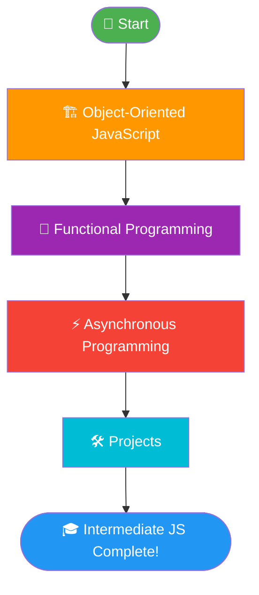
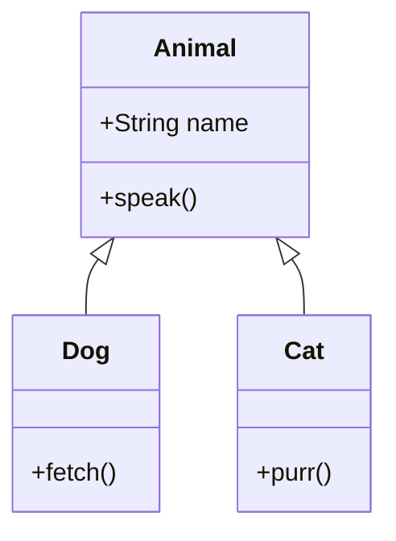
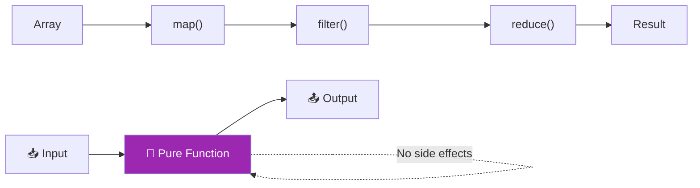
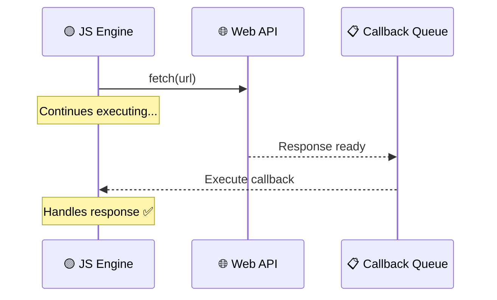
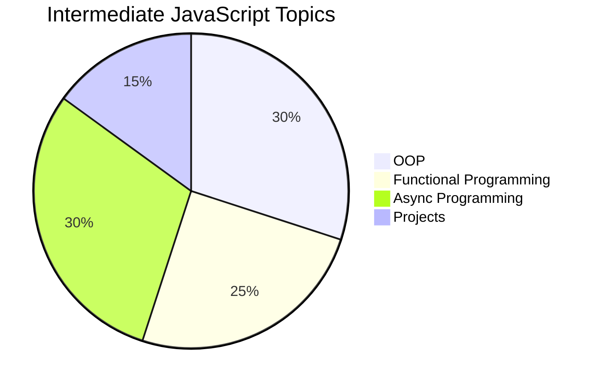

# 🚀 Intermediate JavaScript

> Level up your JavaScript skills — from objects to async magic!

---

## 📚 What You'll Learn

```
┌────────────────────────────────────────────────────────────
│              Intermediate JavaScript                       │ 
│                                                            │
│   🏗️  OOP  →  🔧 Functional  →  ⚡ Async  →  🛠️ Projects │
└────────────────────────────────────────────────────────────┘
```

---

## 🗺️ Learning Roadmap



---

## 1️⃣ Object-Oriented JavaScript 🏗️

> Model real-world things using objects, classes, and inheritance.



### Key Concepts
| Concept | Description |
|---|---|
| 🧱 Classes & Objects | Blueprints for creating objects |
| 🔒 Encapsulation | Bundling data and methods together |
| 🧬 Inheritance | Child class extends parent class |
| 🎭 Polymorphism | Same method, different behavior |
| 🔗 Prototypes | JavaScript's native inheritance model |

---

## 2️⃣ Functional Programming 🔧

> Write cleaner, predictable code using functions as first-class citizens.



### Key Concepts
| Concept | Description |
|---|---|
| 🧼 Pure Functions | Same input → always same output |
| 🔄 Higher-Order Functions | Functions that take/return functions |
| 🔗 Closures | Function remembers its outer scope |
| 🚫 Immutability | Don't mutate, create new data |
| ⛓️ Chaining | `map()` → `filter()` → `reduce()` |

---

## 3️⃣ Asynchronous Programming ⚡

> Handle time-consuming tasks without blocking the main thread.



### Evolution of Async JS
```
Callbacks  →  Promises  →  Async/Await
   😵              😊            🤩
(callback     (chaining)    (reads like
  hell)                     sync code)
```

### Key Concepts
| Concept | Description |
|---|---|
| 🔁 Event Loop | Manages execution of async code |
| 📞 Callbacks | Function called after task completes |
| 🤝 Promises | `.then()` / `.catch()` chaining |
| ✨ Async/Await | Clean syntax for promises |
| 🌐 Fetch API | Make HTTP requests |

---

## 4️⃣ Projects 🛠️

> Apply everything you've learned by building real projects!

```
🛠️ Projects
├── 📋 Task Manager App       → OOP + DOM
├── 🌦️ Weather App            → Fetch API + Async/Await
├── 🛒 Shopping Cart          → Functional Programming
└── 💬 Chat UI                → Promises + Events
```

---

## 📊 Topics Overview



---

## ⚡ Quick Reference

```javascript
// OOP
class Animal {
  constructor(name) { this.name = name; }
  speak() { return `${this.name} makes a sound`; }
}

// Functional
const double = arr => arr.map(x => x * 2);

// Async/Await
const getData = async (url) => {
  const res = await fetch(url);
  return res.json();
};
```

---

<div align="center">

**Happy Coding! 💛**

`JavaScript` • `OOP` • `Functional` • `Async` • `Projects`

</div>
